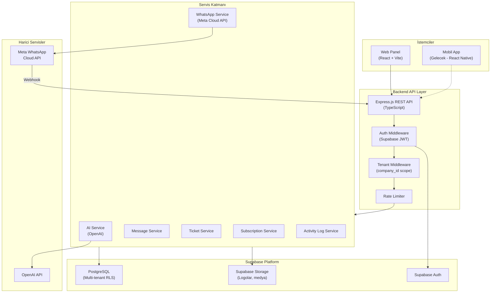
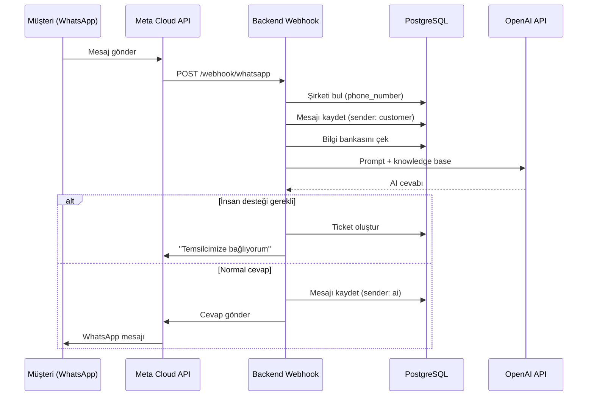

# AI WhatsApp Müşteri Temsilcisi SaaS — Sistem Mimarisi

## Genel Bakış

KKTC ve Türkiye pazarına yönelik çok kiracılı (multi-tenant) bir SaaS platformu. Şirketler WhatsApp üzerinden gelen müşteri mesajlarını AI ile otomatik yanıtlar, gerektiğinde personele aktarır ve tüm iletişimi web panelinden yönetir.

---

## Sistem Mimarisi Diyagramı



---

## Mesaj Akış Diyagramı (AI Chat Engine)



---

## Rol ve Yetki Matrisi

| Modül | SUPER_ADMIN | COMPANY_ADMIN | STAFF |
|-------|:-----------:|:-------------:|:-----:|
| Tüm şirketler | ✅ | ❌ | ❌ |
| Şirket oluşturma | ✅ | ❌ | ❌ |
| Paket yönetimi | ✅ | ❌ | ❌ |
| Platform istatistikleri | ✅ | ❌ | ❌ |
| Firma bilgileri | ✅ | ✅ | ❌ |
| WhatsApp bağlantısı | ✅ | ✅ | ❌ |
| AI bilgi bankası | ✅ | ✅ | ❌ |
| Personel yönetimi | ✅ | ✅ | ❌ |
| Tüm mesajlar | ✅ | ✅ | ❌ |
| Atanan konuşmalar | ✅ | ✅ | ✅ |
| Manuel cevap | ✅ | ✅ | ✅ |
| Ticket yönetimi | ✅ | ✅ | ✅ (atanan) |

---

## API Mimarisi (Mobile-Ready REST)

Tüm endpoint'ler `/api/v1/` prefix'i ile versiyonlanır.

```
POST   /api/v1/auth/login
POST   /api/v1/auth/register
GET    /api/v1/auth/me

# Super Admin
GET    /api/v1/admin/companies
POST   /api/v1/admin/companies
GET    /api/v1/admin/stats
GET    /api/v1/admin/subscriptions

# Company
GET    /api/v1/companies/:id
PUT    /api/v1/companies/:id
GET    /api/v1/companies/:id/dashboard

# WhatsApp
GET    /api/v1/whatsapp/config
PUT    /api/v1/whatsapp/config
POST   /api/v1/whatsapp/test
GET    /api/v1/whatsapp/status
POST   /webhook/whatsapp          (Meta webhook - auth yok)

# Knowledge Base
GET    /api/v1/knowledge
POST   /api/v1/knowledge
PUT    /api/v1/knowledge/:id
DELETE /api/v1/knowledge/:id

# Messages
GET    /api/v1/messages
GET    /api/v1/messages/:conversationId
POST   /api/v1/messages/:conversationId/reply

# Tickets
GET    /api/v1/tickets
POST   /api/v1/tickets
PUT    /api/v1/tickets/:id
PATCH  /api/v1/tickets/:id/assign

# Staff
GET    /api/v1/staff
POST   /api/v1/staff
PUT    /api/v1/staff/:id
DELETE /api/v1/staff/:id

# Subscriptions
GET    /api/v1/subscriptions/current
GET    /api/v1/subscriptions/usage
```

---

## Güvenlik Katmanları

1. **Supabase Auth** — JWT tabanlı kimlik doğrulama
2. **RLS (Row Level Security)** — PostgreSQL seviyesinde tenant izolasyonu
3. **API Middleware** — Rol ve company_id doğrulama
4. **Webhook Verification** — Meta verify token kontrolü
5. **Rate Limiting** — API abuse koruması
6. **Environment Variables** — Tüm secret'lar .env'de

---

## Teknoloji Stack

| Katman | Teknoloji |
|--------|-----------|
| Frontend | React 18, TypeScript, Vite, Tailwind, Shadcn UI, React Query, React Router, Zustand |
| Backend | Node.js, Express.js, TypeScript |
| Database | Supabase PostgreSQL |
| Auth | Supabase Auth |
| Storage | Supabase Storage |
| AI | OpenAI API (gpt-4o-mini) |
| WhatsApp | Meta WhatsApp Cloud API |

---

## Deployment Mimarisi (Önerilen)

```
┌─────────────┐     ┌─────────────┐     ┌─────────────┐
│   Vercel    │     │   Railway   │     │  Supabase   │
│  (Frontend) │────▶│  (Backend)  │────▶│  (DB+Auth)  │
└─────────────┘     └─────────────┘     └─────────────┘
                           │
                           ▼
                    ┌─────────────┐
                    │ Meta + OAI  │
                    └─────────────┘
```
