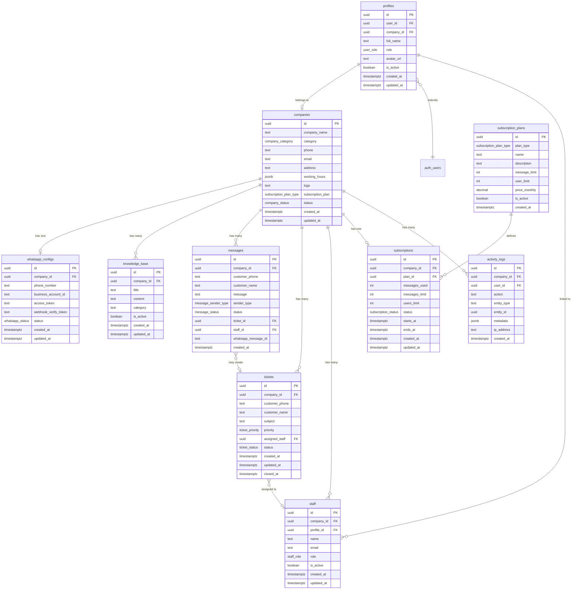

# Database ER Diagram

## Entity Relationship Diagram

---

## Enum Tipleri

| Enum | Değerler |
|------|----------|
| `user_role` | `super_admin`, `company_admin`, `staff` |
| `company_category` | `universite`, `klinik`, `dis_hekimi`, `guzellik_merkezi`, `emlak`, `rent_a_car`, `otel`, `restoran`, `kurs`, `diger` |
| `company_status` | `active`, `inactive`, `suspended`, `trial` |
| `subscription_plan_type` | `starter`, `business`, `enterprise` |
| `subscription_status` | `active`, `expired`, `cancelled`, `trial` |
| `whatsapp_status` | `connected`, `disconnected`, `pending`, `error` |
| `message_sender_type` | `customer`, `ai`, `staff` |
| `message_status` | `open`, `closed`, `transferred` |
| `ticket_priority` | `low`, `medium`, `high`, `urgent` |
| `ticket_status` | `open`, `in_progress`, `resolved`, `closed` |
| `staff_role` | `admin`, `agent`, `supervisor` |

---

## Multi-Tenant İzolasyon Stratejisi

1. Her tenant-scoped tabloda `company_id` foreign key
2. RLS politikaları `auth.uid()` → `profiles.company_id` zinciri ile izolasyon
3. `super_admin` rolü tüm verilere erişebilir (özel RLS policy)
4. Backend middleware ek katman olarak `company_id` doğrular

---

## İndeksler

- `messages(company_id, customer_phone, created_at DESC)` — konuşma listesi
- `tickets(company_id, status, assigned_staff)` — ticket sorguları
- `knowledge_base(company_id, category)` — AI bilgi çekme
- `activity_logs(company_id, created_at DESC)` — log sorguları
- `profiles(user_id)` — auth lookup
- `whatsapp_configs(phone_number)` — webhook şirket eşleme
